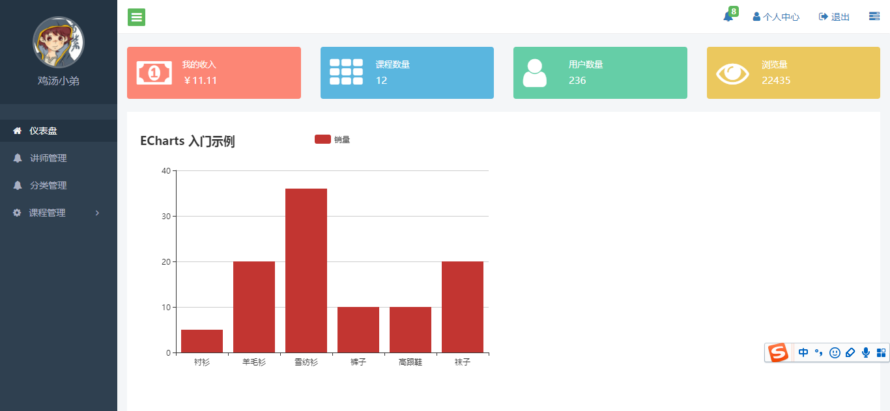

## 静态管理系统

### 技术栈  
1. [artTemplate](https://github.com/aui/art-template) 模板语法
1. [bootstrap](http://www.bootcss.com/)  
1. [bootstrap-datepicker](http://www.bootcss.com/p/bootstrap-datetimepicker/demo.htm) Bootstrap日期和时间表单组件。  
1. [ckeditor](https://ckeditor.com/) 富文本编辑器  
1. [echarts](http://echarts.baidu.com/examples.html) 图表数据  
1. [font-awesome](http://fontawesome.dashgame.com/) 一套绝佳的图标字体库和CSS框架  
1. [jquery](http://jquery.cuishifeng.cn/)  
1. [jquery-cookie](http://plugins.jquery.com/cookie/) 一个简单，轻量级的jQuery插件，用于读取，写入和删除cookie。 
1. [jquery-form](http://malsup.com/jquery/form/)  Form表单插件
1. [jquery-jcrop](http://jcrop.org/) Jcrop是一个jQuery图片裁剪插件
1. [jquery-region](http://plugins.jquery.com/tag/regions/)  三级联动插件
1. [jquery-uploadify](http://www.uploadify.com/)  HTML5或Flash多文件上传jQuery插件脚本
1. [jquery-validate](http://www.jq22.com/jquery-info3350)  Validate是基于jQuery的一款轻量级验证插件  
1. [nprogress](http://www.jq22.com/jquery-info4121)  jQuery nprogress.js页面加载进度条
1. [require](http://requirejs.org/) 模块化规范

### 模块化
+ 整个前端页面使用的是requirejs模块化规范，对js进行管理。

### 图片
+   
+ 